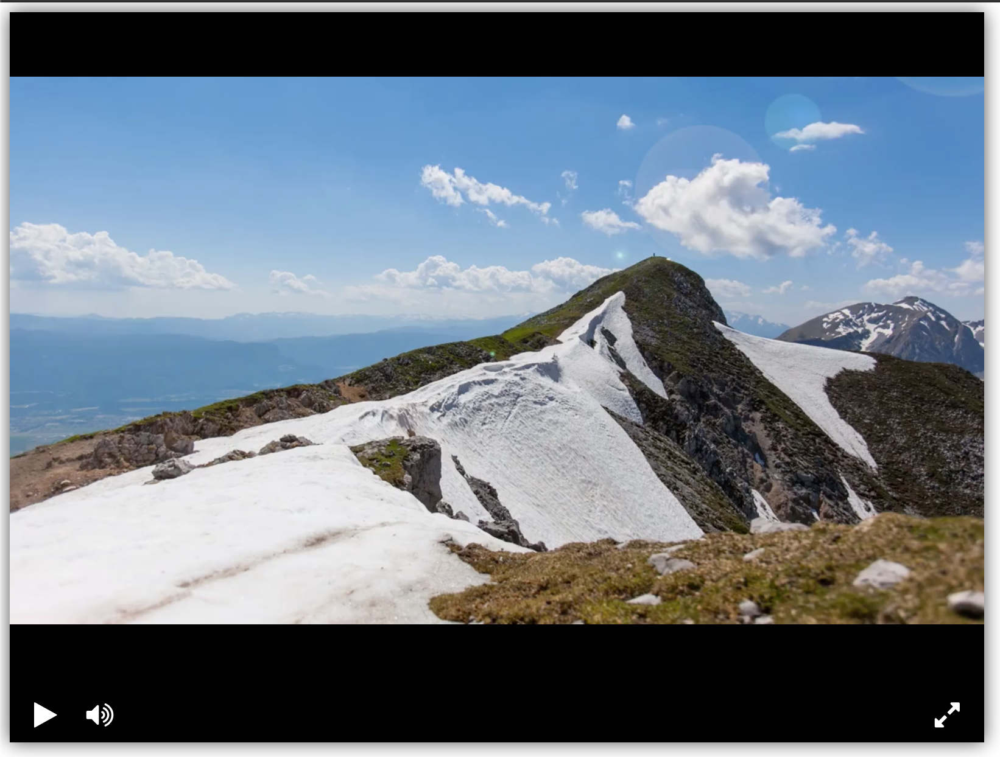

## Video Player

Simple video player based on [Video Player Library](https://github.com/devmanorg/video-player-jslib) by [Devman](https://dvmn.org/).

Demo is [here](https://ekbdizzy.github.io/dvmn-video-player/).
***

## Development with live reload
For life reload you should install libs from `requirements.txt` and run `guardfile.py`: 
~~~
pip install -r requirements.txt
python guardfile.py
~~~
